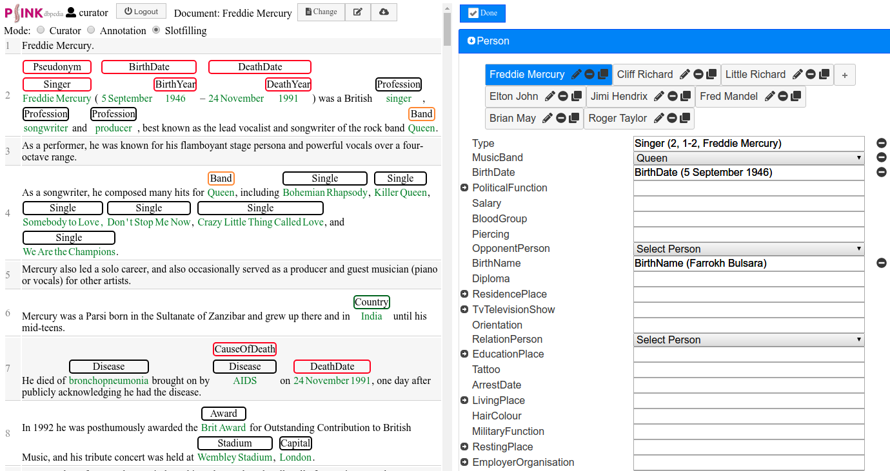

# SANTO

System to gather data for ontology-driven **S**lot filling tasks with a web-based **AN**notation **TO**ol. 

## Description

Supervised machine learning algorithms require training data whose generation for complex relation extraction tasks tends to be difficult. Being optimized for relation extraction at sentence level, many annotation tools lack in facilitating the annotation of relational structures that are widely spread across the text. This leads to non-intuitive and cumbersome visualizations, making the annotation process unnecessarily time-consuming. We propose SANTO, an easy-to-use, domain-adaptive annotation tool specialized for complex slot filling tasks which may involve problems of cardinality and referential grounding. The web-based architecture enables fast and clearly structured annotation for multiple users in parallel. Relational structures are formulated as templates following the conceptualization of an underlying ontology. Further, import and export procedures of standard formats enable interoperability with external sources and tools.



## Citation

If you use this project please cite
> Hartung M, ter Horst H, Grimm F, Diekmann T, Klinger R, Cimiano P (In Press) 
> In: Proceedings of the 56th Annual Meeting of the Association for Computational Linguistics (System Demonstrations). Association for Computational Linguistics.
available at https://pub.uni-bielefeld.de/publication/2919923

## Online Demo

A demo instance that is routinely reset is available at http://psink.techfak.uni-bielefeld.de/santo/

## Requirements

- Apache >= 2.4
- PHP 5.6
- MySQL / MariaDB 5.5

## Installation

### System setup

1. Clone this repository into your web root.
    ```bash
     git clone https://github.com/ag-sc/SANTO.git
    ```
    Alternatively, you can also download a zipped version  of the repository and unzip it in your webservers root directory.
    ```bash
    wget https://github.com/ag-sc/SANTO/archive/master.zip
    unzip master.zip -d SANTO/
    ```
2. Create a MySQL database and user for the project.
    ```bash
    mysql -u<user> -p
    ```
    ```sql
    CREATE DATABASE anno;
    ```
    Please ensure to create a user with access privileges to the newly created database.
    Test your login at https://serveruri/
3. Import schema.sql into the database you created induring step 2.
    ```bash
    ```
4. Adjust config/annodb.config and provide connection details (hostname, username, password, schema (= database name))  for your installation.
    ```
    [database]
    host=localhost
    user=anno_username
    password=anno_password
    schema=anno
    ```
### Adding users and ontology data
5. In the repository root, create an admin user (replace admin by a username and secret by a password): 
    ```bash
    php php/cli_createuser.php admin secret 1
    ```
    The "1" indicates that the created user should be granted curator privileges.
6. For the slot filling functionality to be more useful, you need to specify which groups of ontology classes should be visible on the right hand side. For this, create a file called `groups.txt` in which you specify (tab-delimited, see examples/groups.csv): (internal) group name, the heading of the section in the UI, the name of the Class and a numeric order (1-N) in which the sections will be rendered.
    ```Person Persons Person 1
    Country Countries Country 2
    ```
    The above would generate two sections of persons and country objects with the respective plural form as their heading.
7. Upload your ontology descriptor files (see examples) under https://serveruri/Upload.html
    Several notes here:
    * Please be aware that this drops all existing data, we will likely provide a more convenient upgrade mechanism in the future.
    * Since there is quite a mismatch between ontologies and what annotators are actually required to utilize, you currently have to provide those files manually. We are working on an addon that let's you pick and choose which parts of an ontology file you want to import.

    The configuration also let's you configure URI prefixes for the triples in the RDF and annotation export files (examples are for dbpedia URIs).
### Adding your (pre-annotated) corpus
8. Import a zipped dataset (tokenized publication + annotations). The bulk import script will automatically assign users to their respective publications. Filenames follow the scheme `PublicationName_username.extension`, where extension is `csv` for tokenizations and `annodb`for pre-existing annotations (see example files).
    ```bash
    php php/cli_import.php /path/to/importfile.zip
    ```

    The import script automatically maps tokenized publications and their annotations to existing users by following the naming convention: `<Publication Name>_<Username>.<Extension>`. Make sure to add users beforehand (see step 5). Note that existing annotations must match class names as defined in the ontology.


## Acknowledgements

This work has been funded by the Federal Ministry of Education and Research (BMBF, Germany) in the PSINK project (grant 031L0028A).

## License

See the LICENSE file in the root directory of this repository.

